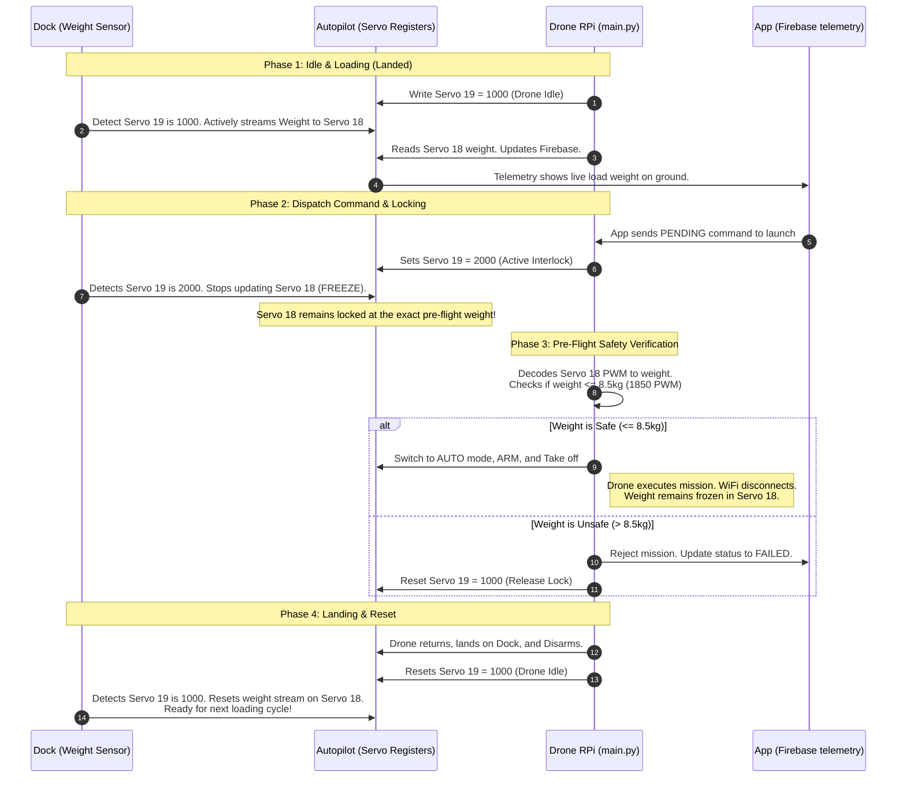

# Two-Way Dock-to-Drone Handshake Protocol
### Virtual Servo Mux (Servo 18 / 19 State Machine)

This document describes the two-way communications architecture between the automated Docking Station, the Drone Companion Computer (RPi running `main.py`), and the ArduPilot Autopilot (Pixhawk) utilizing virtual servo channels for local state persistent handshaking and failsafe protection.

---

## 🏗️ System Overview & Topology

```
   ┌───────────┐                        ┌───────────┐
   │   Dock    │ ◄─── MAVLink WiFi ────►│ Autopilot │
   │ (Sensors) │                        │ (Pixhawk) │
   └───────────┘                        └─────┬─────┘
                                              │ Telemetry Link
                                              ▼
   ┌───────────┐                        ┌───────────┐
   │    App    │ ◄─── Firebase ────────►│ Drone RPi │
   │ (Flutter) │                        │ (main.py) │
   └───────────┘                        └───────────┘
```

* **Dock**: Handles payload loading, load cell weight sensing, and battery charging. Connects to the Pixhawk over a local high-speed MAVLink WiFi network. **Exclusively writes to Servo 18**.
* **Autopilot**: The central broker. Uses its raw servo register states to persist data across long-range flights even after WiFi is lost.
* **Drone RPi**: Listens to Firebase for remote mission commands, decodes telemetry, manages flight states, and coordinates with ArduPilot. **Exclusively writes to Servo 19**.
* **Application (JECH_CLIENT)**: Receives mission telemetry and displays drone position and pre-flight payload weight directly to the admin interface.

---

## 🎛️ Handshake Channels & Math Mapping

### 1. Servo 18 (Dock ➔ Drone: Total Scale Weight Channel)
Instead of a simple binary flag, the Dock maps the total measured load cell weight (which includes the drone itself) **directly to a linear PWM value** on Servo 18. This allows the RPi to decode the exact weight in real-time.

#### **Physical Dry Weight & Disconnection Failsafe:**
* **Drone Dry Weight**: The Drone itself has a dry weight of **5.5 kg** (which corresponds to **1550 PWM** on the scale).
* **Failsafe (Disconnected scale)**: If the Dock is active and connected with the drone on it, the scale's reading must be at least **5.5 kg** (empty drone, no cargo). If the Dock is disconnected or uninitialized, Servo 18 will default to `0` or `1000` PWM.
* **Lockout Rule**: Any value **under 1400 PWM** represents a **disconnected or uninitialized Dock**. In this case, flight is **immediately blocked**.

#### **Mathematical Conversion:**
$$\text{PWM} = 1000 + (\text{Weight}_{\text{kg}} \times 100)$$
$$\text{Weight}_{\text{kg}} = \frac{\text{PWM} - 1000}{100.0}$$

| Total Scale Weight (Drone + Cargo) | Cargo Payload Weight | Servo 18 PWM Value | Safety Assessment | RPi Takeoff Decision |
| :--- | :--- | :--- | :--- | :--- |
| **< 4.0 kg** | *N/A (Disconnected)* | `< 1400 PWM` | **Dock Disconnected Failsafe** | **Blocked (Safety Lockout)** |
| **5.5 kg (Empty Drone)** | **0.0 kg** | `1550 PWM` | Safe (Idle / Ready) | Allowed |
| **7.0 kg** | **1.5 kg** | `1700 PWM` | Safe | Allowed |
| **8.0 kg** | **2.5 kg** | `1800 PWM` | Safe | Allowed |
| **8.5 kg (Max Allowed)** | **3.0 kg** | `1850 PWM` | **Safety Threshold Limit** | **Maximum Limit Allowed** |
| **8.6 kg** | **3.1 kg** | `1860 PWM` | Unsafe (Overweight) | **Blocked** |
| **10.0 kg** | **4.5 kg** | `2000 PWM` | Unsafe (Overweight) | **Blocked** |

* **Lockout / Disconnected Window**: `< 1400` PWM.
* **Safe-to-Fly Window**: `1400` to `1850` PWM.
* **Overweight Window**: `> 1850` PWM.

---

### 2. Servo 19 (Drone ➔ Dock: Active Mission Status)
Controls the interlock loop, preventing the Dock from overriding the weight registers while the drone is arming, taking off, or flying.

* **`1000 PWM` (LOW) ➔ Drone Landed & Idle**: Signals that the drone is safely on the Dock. The Dock is permitted to actively query the scale and stream weight updates to Servo 18.
* **`2000 PWM` (HIGH) ➔ Drone Active / Flying**: Signals that the drone has launched or is about to arm. The Dock **must stop writing to Servo 18** and freeze the last recorded weight value.

---

## 🔄 The Complete Handshake Sequence



---

## 🛠️ Code Implementation Guide

### 1. Dock Implementation (Python/C++ on Dock)
The Dock periodically reads Servo 19. If `Servo 19 < 1500`, it reads the load sensor and updates Servo 18. If `Servo 19 >= 1500`, it does nothing (freezing the flag).

```python
# Dock telemetry loop (run continuously over MAVLink WiFi)
while True:
    # 1. Read Drone Flight Status from Servo 19
    msg = master.recv_match(type='SERVO_OUTPUT_RAW', blocking=True, timeout=1.0)
    if msg:
        drone_status = getattr(msg, 'servo19_raw', 1000)
        
        # 2. If drone is Idle (LOW), update weight on Servo 18
        if drone_status < 1500:
            weight_kg = read_load_sensor()
            # Map 0-10kg to 1000-2000 PWM
            pwm_val = int(1000 + (weight_kg * 100))
            pwm_val = max(1000, min(2000, pwm_val)) # clamp
            
            # Send command to set Servo 18
            master.mav.command_long_send(
                target_system, target_component,
                mavutil.mavlink.MAV_CMD_DO_SET_SERVO, 0,
                18, pwm_val, 0, 0, 0, 0, 0
            )
```

### 2. Drone Companion Computer (`pymavlink_vehicle.py`)
Add tracking for Servo 18 and 19 values inside the reader loop.

```python
# In pymavlink_vehicle.py
self.servo_18_pwm = 1000
self.servo_19_pwm = 1000

# Inside msg_type == 'SERVO_OUTPUT_RAW' handler
elif msg_type == 'SERVO_OUTPUT_RAW':
    self.servo_18_pwm = getattr(msg, 'servo18_raw', 1000)
    self.servo_19_pwm = getattr(msg, 'servo19_raw', 1000)
```

### 3. Drone Mission Logic (`main.py`)
Validate the weight and set state changes before executing the dispatch.

```python
# In main.py: execute_mission_logic()

# 1. Lock the handshake loop (Signal active flight state)
print("[HANDSHAKE] Locking Dock weight flag (Servo 19 = 2000)...")
vehicle.set_servo(19, 2000)  # Custom method sending MAV_CMD_DO_SET_SERVO
time.sleep(1.0)              # Allow Dock to detect lock and freeze Servo 18

# 2. Fetch and decode frozen weight from Servo 18
frozen_pwm = vehicle.servo_18_pwm
print(f"[HANDSHAKE] Frozen Servo 18 PWM: {frozen_pwm}")

# 3. Enforce Disconnection / Empty Safety check (under 1400 PWM = Disconnected)
if frozen_pwm < 1400:
    print(f"[SAFETY] Takeoff REJECTED: Dock disconnected or uninitialized! (PWM: {frozen_pwm} < 1400)")
    ref.update({
        'status': 'FAILED',
        'error': f'Takeoff blocked: Dock disconnected or scale reading uninitialized (PWM: {frozen_pwm})'
    })
    # Release the lock so Dock can connect/re-read
    vehicle.set_servo(19, 1000)
    return False

# 4. Decode Total Measured Weight
total_weight = (frozen_pwm - 1000) / 100.0
cargo_weight = total_weight - 5.5  # Drone dry weight is 5.5kg
print(f"[HANDSHAKE] Scale Measured Total Weight: {total_weight:.2f} kg | Cargo Payload Weight: {cargo_weight:.2f} kg")

# 5. Save weight details to Firebase command payload so it syncs to App telemetry
cmd_ref.update({
    'payload/total_measured_weight': total_weight,
    'payload/cargo_payload_weight': max(0.0, cargo_weight)
})

# 6. Enforce Overweight Safety Check (Max 8.5kg total scale weight)
if total_weight > 8.5:
    print(f"[SAFETY] Takeoff REJECTED: Overweight scale load ({total_weight:.2f}kg > 8.5kg limit)!")
    ref.update({
        'status': 'FAILED',
        'error': f'Takeoff blocked: Scale measured total weight ({total_weight:.2f}kg) exceeds 8.5kg safety limit'
    })
    # Release the lock so Dock can update again
    vehicle.set_servo(19, 1000)
    return False

# 7. Proceed to takeoff
print("[SAFETY] Weight is safe. Arming and starting AUTO mission...")
# ... standard arm and takeoff logic ...
```

---

## 🌟 Architectural Advantages
* **Perfect telemetry records**: Because Servo 18 is frozen during flight, the RPi telemetry updates to Firebase will display the exact, correct weight of the cargo to the user's dashboard throughout the entire trip.
* **Race-Condition Free**: The Dock only writes to Channel 18, and the RPi only writes to Channel 19. Both devices have single-writer authority, eliminating packet race issues completely.
* **Range Independent**: When the drone flies out of WiFi range, ArduPilot preserves the register values. The RPi does not lose its state metrics.
