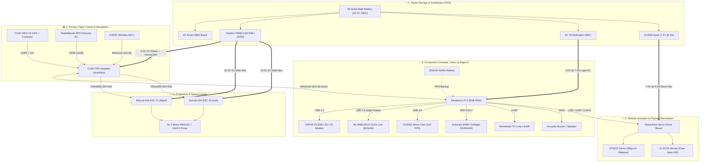

# Hexacopter Specifications

A structured reference document detailing the hardware, avionics, power distribution, and firmware configuration for the custom payload-carrying hexacopter.

---

## 📦 Master Hardware & Avionics Module Directory

| # | Subsystem | Module / Component | Model / Specs | Key Role / Interfaces | Physical Dimensions (L×W×H mm) | Mounting Location |
|---|---|---|---|---|---|---|
| **1** | **Flight Avionics** | **CUAV V6X Autopilot** | STM32H753 (480 MHz), Triple IMU, Dual Baro | Primary Flight Controller (ArduPilot Copter) | 45 × 45 × 17 mm | Center Top Carbon Deck |
| **2** | **Flight Avionics** | **CUAV NEO V3 GPS** | u-blox M9N Multi-GNSS + IST8310 Compass | Centimeter GNSS Position & Heading (UART/I2C) | 56 × 56 × 16 mm | Rear Top Carbon Deck |
| **3** | **Sensors** | **Benewake TF-Luna LiDAR** | 850 nm ToF Rangefinder (0.2 m – 8.0 m) | Terrain Following & Precision Auto-Landing (UART) | 35 × 35 × 24 mm | Forward Underslung Nose |
| **4** | **RC Link** | **RadioMaster RP3 Receiver** | ExpressLRS 2.4 GHz True-Diversity | Low-Latency Manual Control (CRSF @ 416 kbaud) | 22 × 13 × 6 mm | Internal Bay (Right Flank) |
| **5** | **Telemetry** | **ESP32 Subsystem** | Dual-Core 240 MHz MCU + Wi-Fi/BLE | Secondary Wireless MAVLink Telemetry (115.2k) | 48 × 26 × 10 mm | Internal Bay (Left Flank) |
| **6** | **Acoustics** | **RPi Speaker / Buzzer** | Piezo Acoustic Beacon & Audio Header | Arming Alerts, Warning Chimes & Lost Drone Finder | 22 × 22 × 14 mm | Top Deck Flank |
| **7** | **Power System** | **6S Solid-State Battery** | 22.2 V (25.2 V Max), 39 Ah (~865.8 Wh), 7C | Primary High-Density Propulsion Power Source | 180 × 75 × 65 mm | Underslung Belly Tray |
| **8** | **Power System** | **Holybro PM08-CAN PMU** | STM32F405, 2S–14S In, 200 A Cont. / 1000 A Peak | 5.2 V / 3 A FC Supply + DroneCAN Current/Volt Telemetry | 50 × 38 × 14 mm | Internal Center Chassis Bay |
| **9** | **Power System** | **6S Smart BMS Board** | 6-Cell Passive Balancing & Thermal Cutoff | Individual Cell Health, Overcharge/Discharge Protection | 120 × 55 × 12 mm | Battery Belly Enclosure |
| **10** | **Power System** | **5V 7A Dedicated UBEC** | High-Efficiency Synchronous Step-Down | Dedicated 5.0 V @ 7.0 A Power for Raspberry Pi 5 & Vision | 48 × 26 × 12 mm | Internal Chassis Bay |
| **11** | **Power System** | **XL4005 Buck Converter** | DC-DC Step-Down (Tuned to 7.0 V @ 5 A Peak) | Dedicated 7.0 V Regulated Rail for Robotic Servos | 43 × 21 × 14 mm | Internal Chassis Bay |
| **12** | **Companion** | **Raspberry Pi 5 (8GB)** | Broadcom BCM2712 Quad-Core 2.4 GHz (8 GB RAM) | Companion Computer (ROS2, MAVLink-Router, Edge AI) | 85 × 56 × 17 mm | Rear Top Carbon Deck |
| **13** | **Vision** | **Waveshare OV9281 Mono Cam** | 1 MP Global Shutter (1200×800 @ 120 FPS) | High-Speed Tracking & Optical Flow (USB 3.0) | 32 × 32 × 22 mm | Forward Nose Bay (Left) |
| **14** | **Vision** | **Arducam 64MP OwlSight** | OmniVision OV64A40, 64MP Motorized Autofocus (F1.9, 84° FOV) | High-Resolution Aerial Inspection & Survey (MIPI CSI-2) | 25 × 24 × 12 mm | Forward Nose Bay (Right) |
| **15** | **Connectivity** | **CAPUF EC200U 4G LTE** | Quectel EC200U-CN Cat 1 Modem + GNSS | Beyond Visual Line of Sight (BVLOS) 4G Telemetry (USB) | 40 × 30 × 10 mm | Top Deck Flank |
| **16** | **Connectivity** | **BL-M8812EU2 5GHz Wi-Fi** | Realtek RTL8812EU (800mW / 29dBm, 2T2R 802.11ac) | High-Power Long-Range Digital Video & Data Link (USB 2.0) | 32 × 32 × 10 mm | Internal Chassis Bay (Right Flank) |
| **17** | **Propulsion** | **BotLab 55A ESC #1** | AM32 32-bit AT32F421 4-in-1 ESC (Ch 1–3) | Drives Motors 1, 2, 3 via Digital DShot600 | 44 × 44 × 9 mm | Internal Bay (Right Side) |
| **18** | **Propulsion** | **BotLab 55A ESC #2** | AM32 32-bit AT32F421 4-in-1 ESC (Ch 4–6) | Drives Motors 4, 5, 6 via Digital DShot600 | 44 × 44 × 9 mm | Internal Bay (Left Side) |
| **19** | **Propulsion** | **6 × T-Motor MN4110 KV400** | 12N14P Brushless Motors + 16×5.5 Carbon Props | 6-Rotor Heavy-Lift Propulsion System | Φ47.4 × 36.7 mm (ea.) | Arm Tips 1 to 6 |
| **20** | **Actuation** | **Waveshare Servo Driver** | Multi-Channel Serial Bus Servo Interface Board | ST/SC Protocol Command & Power Router (UART/USB) | 45 × 35 × 12 mm | Underslung Actuator Base |
| **21** | **Actuation** | **ST3215 Servo (30 kg·cm)** | High-Torque Programmable Serial Bus Servo | Heavy Payload Drop & Winch Articulation | 40 × 20 × 40 mm | Underslung Payload Rig |
| **22** | **Actuation** | **2 × SC09 Servos (2.3 kg·cm)** | Dual Micro Serial Bus Servos (Jaws A & B) | Precision Robotic Gripper Jaw Actuation | 23 × 12 × 25 mm (ea.) | Robotic Claw Mechanism |

---

## 1. System Overview & Key Metrics
* **Platform Type:** Hexacopter (6-Rotor Multirotor)
* **Configuration:** Payload Frame X
* **Dry Weight (No Battery):** 5.5 kg
* **All-Up Weight (AUW / Takeoff Weight):** 10.5 kg
* **Battery Weight:** 2.8 kg (Solid-state high density)
* **Estimated Flight Time:** 27 minutes (at 10.5 kg AUW)

---

## 2. Modular Subsystem Architecture & Signal Flow

The hexacopter's avionics, compute, power, and actuation are structured into **5 distinct subsystems** connected via standardized industrial protocols:



### 2.1 Subsystem 1: Companion Compute, Vision & Edge AI
* **Mission Role:** High-level autonomy, obstacle avoidance, computer vision, object tracking, BVLOS cloud telemetry, and edge processing.
* **Hardware Modules:**
  * **Raspberry Pi 5 (8GB RAM):** Primary onboard computer running Ubuntu Linux, ROS 2, and `mavlink-router`.
  * **5V 7A Dedicated UBEC:** Primary 5.0 V @ 7.0 A regulated power supply stepped down from the main 6S battery.
  * **500 mAh Buffer Battery:** UPS buffer circuit preventing sudden power loss file corruption on the Raspberry Pi NVMe/microSD.
  * **CAPUF EC200U 4G LTE Modem:** Cellular data uplink supporting remote GCS telemetry over ZeroTier VPN.
  * **BL-M8812EU2 High-Power 5GHz Wi-Fi Link:** Realtek RTL8812EU 802.11a/n/ac 2T2R module (up to 29 dBm / ~800 mW) for long-range, low-latency HD video streaming (WFB-ng / RTSP) and high-throughput companion data telemetry, operating outside the 2.4 GHz RC band.
  * **Waveshare OV9281 Monochrome Camera:** 1 MP Global Shutter (120 FPS USB 3.0) for high-speed tracking and visual odometry.
  * **Arducam 64MP OwlSight (OV64A40):** 64 MP ultra-high-resolution inspection sensor with motorized autofocus (CDAF/VCM), native `libcamera` integration via MIPI CSI-2.
  * **Benewake TF-Luna LiDAR:** 850 nm Time-of-Flight rangefinder (0.2 m – 8.0 m) for precision distance sensing.
  * **RPi Speaker / Piezo Buzzer:** Audible feedback, arming chimes, and acoustic beacon.
* **Inter-Subsystem Links:** Connected to **Subsystem 2 (CUAV V6X Autopilot)** via high-speed UART (`SERIAL5 @ 921,600 baud`) running MAVLink 2.

### 2.2 Subsystem 2: Primary Flight Control & Navigation (Avionics)
* **Mission Role:** Multirotor flight stabilization, sensor fusion (EKF3), GNSS navigation, and manual safety pilot overrides.
* **Hardware Modules:**
  * **CUAV V6X Autopilot:** STM32H753 (480 MHz), Triple-redundant IMU system, Dual Barometers, running ArduPilot Copter firmware.
  * **CUAV NEO V3 GNSS & Compass:** u-blox M9N multi-constellation satellite receiver + IST8310 magnetometer mounted directly on the top deck.
  * **RadioMaster RP3 Diversity Receiver:** ExpressLRS 2.4 GHz dual-antenna receiver (CRSF @ 416 kbaud) for ultra-low latency manual pilot link.
  * **ESP32 Wireless Subsystem:** Dual-core 240 MHz MCU providing local Wi-Fi/BLE MAVLink telemetry and payload trigger backup.
* **Inter-Subsystem Links:** Powered by **Subsystem 4 (PM08-CAN)** via regulated 5.2 V / 3 A redundant rail + DroneCAN bus; outputs motor timing to **Subsystem 3 (ESCs)** via DShot600.

### 2.3 Subsystem 3: Propulsion & Drive Subsystem
* **Mission Role:** Generates vertical lift, horizontal translation, and roll/pitch/yaw attitude moments across 6 rotor arms.
* **Hardware Modules:**
  * **BotLab Dynamics 55A 4-in-1 ESC #1 (Right Side):** 32-bit AM32 ESC driving Motors 1, 2, and 3 via digital DShot600.
  * **BotLab Dynamics 55A 4-in-1 ESC #2 (Left Side):** 32-bit AM32 ESC driving Motors 4, 5, and 6 via digital DShot600.
  * **6 × T-Motor MN4110 KV400 Brushless Motors:** 12N14P high-torque industrial brushless motors.
  * **6 × 16×5.5" Carbon Fiber Propellers:** 3 Clockwise (CW) and 3 Counter-Clockwise (CCW) matched pairs.
* **Inter-Subsystem Links:** High-current 22.2 V DC power from **Subsystem 4 (PM08-CAN)**; control signals from **Subsystem 2 (CUAV V6X)**.

### 2.4 Subsystem 4: Power Storage, Management & Distribution (PDS)
* **Mission Role:** Centralized power conditioning, battery management, current/voltage sensing, and multi-voltage step-down regulation.
* **Hardware Modules:**
  * **6S Solid-State Battery Pack (22.2 V Nominal, 25.2 V Max, 39 Ah, ~865.8 Wh, 7C / 273 A):** High-density energy source.
  * **6S Smart BMS Board:** Individual cell balance monitoring, overcurrent, overdischarge, and thermal safety cutoffs.
  * **Holybro PM08-CAN Power Module (200 A Cont. / 1000 A Peak):** System current/voltage telemetry via DroneCAN + 5.2 V / 3 A clean FC power.
  * **5V 7A Synchronous UBEC:** Dedicated 5.0 V @ 7.0 A logic power for companion computer and cameras.
  * **XL4005 DC-DC Buck Converter:** Dedicated 7.0 V @ 5.0 A peak step-down rail for the robotic servos.
  * **Main Anti-Spark Power Bus:** XT90-S connectors with heavy-gauge 8AWG/10AWG silicone wiring.

### 2.5 Subsystem 5: Robotic Actuation & Payload Mechanism
* **Mission Role:** Remote cargo release, winch cable management, and robotic gripper claw manipulation.
* **Hardware Modules:**
  * **Waveshare Serial Bus Servo Driver Board:** UART/USB controller board managing multi-servo communication and power distribution.
  * **ST3215 High-Torque Serial Bus Servo (30 kg·cm):** Primary high-force payload release latch / winch drop mechanism.
  * **2 × SC09 Micro Serial Bus Servos (2.3 kg·cm):** Articulated robotic claw gripper jaws (Jaw A & Jaw B).
* **Inter-Subsystem Links:** Commanded by **Subsystem 1 (Raspberry Pi 5)** via serial/USB; powered by **Subsystem 4 (XL4005 7.0V rail)**.

---

## 3. Frame & Structural Specifications
* **Frame Model/Type:** Custom Carbon Fiber Payload Frame
* **Wheelbase:** 780mm (Middle Arms) to 950mm diagonal
* **Material:** Carbon Fiber
* **Landing Gear Type:** Fixed Legs
* **Total Dry Weight:** 5.5 kg

---

## 4. Propulsion System
The propulsion architecture utilizes six motors and propellers driven by two centralized 4-in-1 ESC boards:

### 4.1 Motors
* **Model:** T-MOTOR MN4110
* **KV Rating:** 400 KV
* **Configuration:** 12N14P (Stator configuration)
* **Dimensions:** Φ47.4 × 36.7 mm
* **Shaft Diameter:** 6mm (Input) / 4mm (Output)
* **Max Continuous Current:** 32 A
* **Max Voltage:** 6S LiPo/Li-ion
* **Weight (per motor):** 144 g (excluding cables) / ~152g (with cables)
* **Hover Current (Approximate):** 15 A (per motor at AUW load conditions)
* **High-Temp Resistance:** Up to 220°C copper wire windings, N45SH magnets, and centrifugal cooling design

### 4.2 Electronic Speed Controllers (ESCs)
* **Model:** BotLab Dynamics BotDrive 55A 4-in-1 ESC (2 × Units, 8 total channels; 6 channels active for hexacopter, 2 spare channels)
* **Continuous / Peak Current:** 55 A continuous / 60 A burst (per channel)
* **Input Voltage:** 2S–6S LiPo (8.4 V – 25.2 V)
* **MCU / Processor:** 32-bit Artery AT32F421G8U7 (120 MHz ARM® Cortex®-M4)
* **MOSFET Driver:** FD6288Q
* **Protocol:** DShot300 / DShot600 (Supports Bi-directional DShot, PWM, and Telemetry)
* **Firmware:** AM32 (Target: `AM32_AT32PB4_540_F421` / `AM32_F4A_4IN1_F421`)
* **Mounting Pattern:** Standard 30.5 mm × 30.5 mm (M3/M4 with anti-vibration silicone grommets)
* **Current Sensing & Telemetry:** Integrated analog current sensor + digital ESC telemetry output
* **Capacitance & Filtering:** Low-ESR 1000 µF high-frequency capacitor per 4-in-1 ESC unit to suppress voltage spikes and ripple
* **Configuration / Integration:** 
  * **ESC #1:** Drives Motors 1 to 3 (Channel 4 spare / auxiliary)
  * **ESC #2:** Drives Motors 4 to 6 (Channel 4 spare / auxiliary)
  * *Alternatively configured as ESC #1 (Motors 1–4) and ESC #2 (Motors 5–6 with 2 spare channels)*
* **BEC Output:** None (Opto/Direct battery voltage input, requires flight controller / external PMU for avionics 5V/12V rails)

### 4.3 Propellers
* **Size:** 16 × 5.5 inches
* **Material:** Carbon Fiber
* **Mounting Style:** Dual-hole direct mount
* **Layout:** 3 × Clockwise (CW), 3 × Counter-Clockwise (CCW)

---

## 5. Flight Control & Avionics
* **Flight Controller (FC):** CUAV V6X
* **Firmware Target:** Pixhawk 6X Firmware (PX4/ArduPilot compatible)
* **Main Processor:** STM32H753IIK6 (ARM® Cortex®-M7, 480MHz, with double-precision FPU)
* **Coprocessor:** STM32F103 (ARM® Cortex®-M3)
* **Memory:** 2MB Flash, 1MB RAM
* **IMU (Triple Redundant, Heated, Isolated):**
  * IMU 1: Bosch BMI088 (vibration-resistant accelerometer/gyro)
  * IMU 2: InvenSense ICM-20649 (high-G accelerometer/gyro)
  * IMU 3: InvenSense ICM-42688-P (ultra-low-noise accelerometer/gyro)
* **Compass:** RM3100 (Automotive grade, high-precision magnetic sensor)
* **Barometer:** Dual ICP-20100 (Dual redundant barometers)
* **Interfaces:** 100M Ethernet PHY, up to 16 PWM outputs, CAN, UART, SPI

### 5.1 Serial Port Mapping
| Port | Mapping | Protocol / Device | Notes & Configuration |
| :--- | :--- | :--- | :--- |
| **SERIAL0** | USB | USB / MAVLink | Direct PC connection for Mission Planner & firmware setup |
| **SERIAL1** | UART7 | Telem1 / ESP32 | Connected to **ESP32 Subsystem** (`SERIAL1_PROTOCOL = 2` / MAVLink or custom telemetry) |
| **SERIAL2** | UART5 | Telem2 / LiDAR | Connected to **Benewake TF-Luna LiDAR** (`SERIAL2_PROTOCOL = 9`, `RNGFND1_TYPE = 20`, 115200 baud) |
| **SERIAL3** | USART1 | GPS1 | Connected to **CUAV NEO V3** Primary GNSS + IST8310 Compass (`GPS_TYPE = 1`) |
| **SERIAL4** | UART8 | GPS2 / RC In | Connected to **RadioMaster RP3 Diversity Rx** (CRSF / ELRS Protocol, `SERIAL4_PROTOCOL = 23`) |
| **SERIAL5** | USART2 | Telem3 / Companion | Connected to **Raspberry Pi 5 Companion Computer** (`SERIAL5_PROTOCOL = 2` / MAVLink2, 921600 baud) |
| **SERIAL6** | UART4 | User | Auxiliary / Spare serial interface |
| **SERIAL7** | USART3 | Debug | System debug console output |
| **SERIAL8** | USB Virtual | MAVLink / SLCAN | USB Virtual (CAN pass-through) |

### 5.2 GNSS / GPS Module
* **Model:** CUAV NEO V3
* **GNSS Engine:** u-blox M9N (Concurrent reception of 4 GNSS constellations)
* **Satellites Supported:** GPS, GLONASS, Galileo, BeiDou
* **Nav Update Rate:** Up to 25 Hz
* **Compass:** IST8310 (Integrated)
* **Horizontal Accuracy:** ~1.5m to 2.0m
* **Features:** Integrated buzzer, safety switch, RGB status light, and SAW+LNA+SAW triple-filter design to block interference
* **Weight:** 33 g

### 5.3 Precision Rangefinder / LiDAR
* **Model:** Benewake TF-Luna LiDAR
* **Technology:** 850nm Infrared Time-of-Flight (ToF) Solid-State LiDAR
* **Operating Range:** 0.2 m – 8.0 m (@ 90% reflectivity)
* **Accuracy:** ±6 cm @ (0.2 m – 3.0 m), ±2% @ (3.0 m – 8.0 m)
* **Distance Resolution:** 1 cm
* **Field of View (FoV):** 2°
* **Adjustable Frame Rate:** 1 Hz – 250 Hz (Default: 100 Hz)
* **Interface & Connection:** Serial UART connected to CUAV V6X **`SERIAL2` (TELEM2)**
* **ArduPilot Configuration:**
  * `SERIAL2_PROTOCOL` = `9` (Lidar / Rangefinder)
  * `SERIAL2_BAUD` = `115` (115200 baud)
  * `RNGFND1_TYPE` = `20` (Benewake TFmini / TF-Luna)
  * `RNGFND1_MIN_CM` = `20`
  * `RNGFND1_MAX_CM` = `800`
  * `RNGFND1_ORIENT` = `25` (Downward-facing for precision AGL altitude hold, terrain following & auto-landing assist)
* **Operating Voltage / Current:** 5V DC ±0.1V / ~70 mA (peak 150 mA)

### 5.4 Auxiliary Microcontroller Subsystem (ESP32)
* **Microcontroller:** ESP32 Dual-Core 32-bit Xtensa® LX6 @ 240 MHz
* **Wireless Capabilities:** 2.4 GHz Wi-Fi (802.11 b/g/n) & Bluetooth v4.2 BR/EDR/BLE
* **Interface & Connection:** Serial UART connected to CUAV V6X **`SERIAL1` (TELEM1)**
* **Configuration:** `SERIAL1_PROTOCOL` = `2` (MAVLink2) / Custom serial payload telemetry
* **Function & Roles:**
  * Secondary telemetry bridge & wireless ground comms
  * Payload release mechanism trigger & auxiliary sensor aggregation
  * Custom safety override and status LED/lighting sequence controller

### 5.5 Companion Computer (Raspberry Pi 5) & Connected Peripherals
* **Compute Board:** Raspberry Pi 5
  * **Processor:** Broadcom BCM2712 (Quad-core 64-bit ARM® Cortex®-A76 @ 2.4 GHz)
  * **Memory:** 8 GB LPDDR4X-4267 SDRAM
  * **Storage:** High-speed NVMe M.2 SSD / MicroSD Card
  * **OS:** Raspberry Pi OS 64-bit / Ubuntu Server (Linux Kernel 6.x) with ROS2 support
  * **Connection to FC:** Connected to CUAV V6X **`SERIAL5` (TELEM3)** via high-speed UART (`SERIAL5_PROTOCOL = 2` / MAVLink2, `SERIAL5_BAUD = 921600`) or 100M Ethernet
  * **Power Supply:** Dedicated 5V / 7A High-Current UBEC (Step-Down DC-DC regulator from 6S main battery)

* **Dual Camera Vision Subsystem:**
  1. **High-Speed Monochrome Global Shutter Camera:**
     * **Model:** Waveshare OV9281 1MP Mono USB Camera (A)
     * **Sensor:** OmniVision OV9281 (1/4" Monochrome, Global Shutter)
     * **Frame Rate:** Up to 120 FPS high frame rate recording (1280 × 800 @ 120fps)
     * **Interface:** USB 2.0 / USB 3.0 port on Raspberry Pi 5
     * **Use Cases:** Distortion-free optical flow, high-speed visual tracking, computer vision edge navigation, and obstacle avoidance
  2. **High-Resolution Autofocus Payload Camera (Arducam 64MP OwlSight):**
     * **Model & SKU:** Arducam 64MP OwlSight Autofocus Camera Module for Raspberry Pi (SKU: B0399 / OV64A40)
     * **Sensor Model:** OmniVision OV64A40 (1/1.32" Optical Format, Quad-Bayer BSI CMOS)
     * **Still Resolution:** 64 Megapixels (9248 × 6944 active pixel array)
     * **Pixel Size:** 1.008 µm × 1.008 µm (2.016 µm equivalent in 16MP 4-in-1 superpixel binned mode)
     * **Shutter Type:** Electronic Rolling Shutter (ERS)
     * **Optics & Lens Parameters:**
       * **Focal Length:** 6.65 mm
       * **Aperture (F.NO):** F1.9 ± 5%
       * **Field of View (FOV):** 84° (Diagonal) × 68° (Horizontal) × 56° (Vertical)
       * **Optical Distortion:** < 1.5%
       * **Filter:** Built-in 650nm IR-cut filter (visible daylight spectrum)
     * **Focus Mechanism:** Motorized programmable dual-mode focus (Contrast Detection Autofocus / CDAF + Manual VCM software step control, 0–1023 steps)
       * **Focus Range:** 8 cm to Infinity (∞)
       * **Continuous AF:** Supported natively via `--autofocus-mode continuous`
     * **Supported Video & Resolution Modes:**
       * **9152 × 6944 (Full 64MP Still Capture):** Up to 2.7 FPS (ultra-detailed asset inspection / photogrammetry)
       * **4624 × 3472 (16MP 4-in-1 Binned / Superpixel):** Up to 10 FPS (high dynamic range, low-light optimization)
       * **3840 × 2160 (4K UHD):** Up to 20 FPS (raw sensor feed)
       * **2312 × 1736:** Up to 30 FPS
       * **1920 × 1080 (1080p FHD):** Up to 60 FPS (standard real-time inspection & video pipeline)
       * **1280 × 720 (720p HD):** Up to 120 FPS
     * **Hardware Interface & Cabling to Raspberry Pi 5:**
       * **Bus:** MIPI CSI-2 (2-lane / 4-lane high-speed differential receiver)
       * **Cable:** 15-pin (1.0 mm pitch, camera side) to 22-pin (0.5 mm pitch, RPi 5 side) flexible flat cable (FPC)
       * **Connector Assignment:** Connected to Raspberry Pi 5 **CAM0** (or CAM1) CSI port
       * **Link Frequency:** 360 MHz (`link-frequency = 360000000`)
     * **Software Driver & Linux Stack (`libcamera`):**
       * **Driver:** In-tree Linux kernel driver (`ov64a40`), native support in Raspberry Pi OS Bookworm (Kernel 6.x) without proprietary vendor patches
       * **Boot Config (`/boot/firmware/config.txt`):**
         ```text
         camera_auto_detect=0
         dtoverlay=ov64a40,cam0,link-frequency=360000000
         ```
       * **Command-Line & Test Operations:**
         ```bash
         # List active camera
         rpicam-still --list-cameras

         # Live stream preview with continuous autofocus
         rpicam-still -t 0 --autofocus-mode continuous

         # Capture full 64MP image
         rpicam-still -o inspection_64mp.jpg --width 9248 --height 6944
         ```
     * **Electrical Specifications:**
       * **Input Voltage:** 3.3 V DC (powered directly via MIPI CSI FPC from Raspberry Pi 5)
       * **Power Consumption:** ~1.2 W – 1.8 W (active capture + VCM focus actuator drive)
     * **Physical Characteristics:**
       * **Board Dimensions:** 25 mm × 24 mm × 12 mm
       * **Weight:** ~15 g
       * **Mounting Position:** Forward Nose Bay (Right side, paired symmetrically with the OV9281 Mono Cam on the Left side)
     * **Operational Roles & Use Cases:**
       * **Precision Asset Inspection:** High-resolution inspection of power lines, wind turbine blades, solar panel micro-cracks, and structural fasteners.
       * **Lossless Digital Zoom:** Down-sampling or cropping the 64MP canvas allows up to 4×–8× digital zoom without mechanical gimbal lenses.
       * **Aerial Photogrammetry:** High-density orthomosaic image capture with GPS geotagging synchronized via companion MAVLink telemetry.

* **High-Power 5GHz Digital Video & High-Throughput Telemetry Link (BL-M8812EU2):**
  * **Module Model:** BL-M8812EU2 High-Power 5GHz Wireless Module
  * **Core Chipset:** Realtek RTL8812EU-CG (High-performance 802.11a/n/ac Dual-Stream WLAN Controller)
  * **Frequency Band:** 5.150 GHz – 5.850 GHz (Single-band 5 GHz; prevents desensitization/interference with the 2.4 GHz RadioMaster RP3 ExpressLRS control link and onboard 2.4 GHz Wi-Fi/Bluetooth)
  * **RF Front-End & Transmit Power:**
    * **MIMO Configuration:** 2T2R (2 Transmit, 2 Receive)
    * **Integrated FEM:** Dedicated high-power Front-End Modules (integrated Power Amplifiers + Low-Noise Amplifiers)
    * **RF Transmit Power:** Up to **29 dBm (≤800 mW)** per channel
    * **Receiver Sensitivity:** -93 dBm @ 10 MHz BPSK; -71 dBm @ 80 MHz MCS9
  * **Bandwidth Modes:**
    * **Supported Channels:** 10 MHz, 20 MHz, 40 MHz, 80 MHz
    * **Narrowband Support (10 MHz):** Enables enhanced range, superior link budget (+3 dB gain), and maximum obstacle penetration for long-range UAV telemetry
    * **Max PHY Rate:** Up to 867 Mbps (80 MHz 2T2R 802.11ac)
  * **Physical Interface & Connection to Raspberry Pi 5:**
    * **Host Bus:** USB 2.0 High-Speed (480 Mbps)
    * **Wiring:** Connected directly to one of the Raspberry Pi 5 USB 2.0 ports (or dedicated internal 4-pin header: `5V`, `D-`, `D+`, `GND`)
    * **RF Connectors:** Dual IPEX / U.FL (MHF1) connectors on module board leading to chassis-mounted SMA bulkhead pigtails
    * **Antennas:** Dual matched 5.8 GHz high-gain omnidirectional dipole / circularly polarized cloverleaf antennas
  * **Power & Thermal Requirements:**
    * **Input Voltage:** 5.0 V DC (±0.25 V)
    * **Peak Current Draw:** Up to 1.8 A during high-power continuous transmission (~9.0 W peak DC load)
    * **Power Feed:** Powered directly from the companion 5.0 V logic rail supplied by the high-current **5V 7A Dedicated UBEC**
    * **Thermal Dissipation:** Requires an aluminum finned heatsink and airflow across the module shielding can due to the thermal load of the 800 mW PA
  * **Software Stack, Drivers & Operational Protocols:**
    * **Linux Kernel Driver:** `rtl88x2eu` / `8812eu` kernel module with monitor mode and frame injection support on Raspberry Pi OS 64-bit (Linux Kernel 6.x)
    * **Video Transmission Engine:** Supports **WFB-ng (WiFiBroadcast next-generation)**, OpenIPC, Ruby FPV, or GStreamer/RTSP pipelines for ultra-low latency (30–60 ms) direct digital HD video feed
    * **Telemetry Integration:** Transparent bidirectional MAVLink forwarding and high-bandwidth ROS 2 DDS communication bridging the companion computer to the Ground Control Station laptop/tablet
  * **Operational Use Cases:**
    * **Direct HD Video Downlink:** Transmits low-latency 1080p/720p 60 FPS live video from the OV9281 or downsampled Arducam feed to ground monitors without relying on cellular networks
    * **High-Speed ROS 2 Data Link:** Streams point clouds, LiDAR distance arrays, and onboard computer vision metadata in real-time
    * **Non-Interfering Dual-Band Radio System:** Allows simultaneously running high-power video on 5.8 GHz while maintaining bulletproof manual control on 2.4 GHz ELRS without mutual RF jamming

* **Audio & Acoustic Output Subsystem:**
  * **Audio Output:** Dedicated RPi Active Buzzer / Speaker Module (wired GPIO / USB sound card or Bluetooth mini speaker)
  * **Function:** Acoustic flight mode announcements, arming/disarming sound cues, collision/obstacle proximity warnings, and audible lost-drone locator beacon

* **Serial Bus Servo Actuation Subsystem:**
  * **Servo Driver Board:** Waveshare Serial Bus Servo Driver Board
    * **Features:** Integrated dedicated servo power management circuit and serial bus communication controller; supports simultaneous control of ST and SC series bus servos
    * **Power Input:** 7.0 V DC supplied from the XL4005 Buck Converter
    * **Interface:** Connected to Raspberry Pi 5 via USB Type-C / UART
  * **Connected Servos:**
    1. **1× ST3215 Programmable Serial Bus Servo:**
       * **Type:** High-Torque Programmable Serial Bus Servo
       * **Operating Voltage:** 7.0 V (from XL4005 buck converter rail)
       * **Torque:** High torque with magnetic encoder telemetry feedback (position, load, temperature)
       * **Role:** Heavy payload release, main robotic arm joint, or primary gimbal pitch/yaw axis
    2. **2× SC09 Miniature Serial Bus Servos:**
       * **Type:** Compact Serial Bus Servos
       * **Operating Voltage:** 7.0 V (within SC09 rated range 4.8V–7.4V)
       * **Operating Range:** 300° position control or 360° continuous rotation
       * **Role:** Dual-finger payload gripper jaws, pan-tilt camera actuation, or secondary payload latches

---

## 6. Power Distribution & Battery System
* **Battery Type:** Li-ion Solid State (Silicon-anode or custom high-density chemistry)
* **Cell Configuration:** 6S (6 Cells in Series / 22.2 V Nominal, 25.2 V Max)
* **Capacity:** 39,000 mAh (39 Ah)
* **Battery Pack Weight:** 2.8 kg
* **Dimensions (Measurements):** ~210 mm × 88 mm × 67 mm (L × W × H)
* **Specific Energy Density:** ~309 Wh/kg (Premium high-density solid-state chemistry)
* **Discharge Rate (C-Rating):** 7C continuous (~273 A continuous output)

### 6.1 Battery Management System (BMS) & Charging
* **BMS Type:** Integrated 6S Smart BMS Board
* **Protections:**
  * Overcharge Protection (per-cell cutoff @ 4.25 V ± 0.05 V)
  * Overdischarge Protection (per-cell cutoff @ 2.8 V – 3.0 V)
  * Overcurrent & Short-Circuit Protection with auto-recovery
  * High-Temperature Thermal Cutoff Protection
  * Integrated Passive Cell Balancing
* **Charging Interface:** Dedicated high-current P+ / P- charging leads
* **Charging Method:** CC/CV (Constant Current / Constant Voltage) 6S Charger (Maximum Charge Voltage: 25.2 V)

### 6.2 Power Distribution & Voltage Regulators (BECs)
* **Power Module / PMU:** Holybro PM08-CAN 200A Power Module
  * **Processor:** STM32F405RG (168 MHz)
  * **Input Voltage:** 2S–14S (7.0 V – 60.9 V DC)
  * **Current Capacity:** 200 A Continuous / 400 A Burst (1s) / 1000 A Peak (<1s); sensing up to 376 A
  * **Telemetry Protocol:** DroneCAN / UAVCAN (connected to CUAV V6X CAN port)
  * **Output to FC:** Regulated 5.2 V / 3.0 A redundant flight controller power rail
  * **Enclosure & Connectors:** CNC Aluminum heat-sink case with dual XT90-S anti-spark connectors
* **Primary ESC Power Harness:** Heavy-gauge 8AWG/10AWG main DC bus branching directly from Holybro PM08-CAN to the 2 × BotLab 4-in-1 ESCs
* **Regulator Rail 1 (Companion Compute & Vision):** Dedicated **5V / 7A High-Current UBEC** supplying the Raspberry Pi 5, Dual Cameras (OV9281 & Arducam 64MP OwlSight), CAPUF EC200U modem, and the **BL-M8812EU2 High-Power 5GHz Wi-Fi link** (drawing up to 1.8 A peak during 800 mW RF transmission)
* **Regulator Rail 2 (Servo Actuation):** **XL4005 Step-Down DC-DC Buck Converter** (tuned to **7.0 V** output, up to 5A peak current) powering the Waveshare Serial Bus Servo Driver Board and the ST3215 & SC09 servos

### Derived Power Specs (Nominal)
* **Nominal Voltage:** 22.2 V (3.7 V per cell)
* **Total Energy Capacity:** ~865.8 Wh (Watt-hours)
* **Max Continuous Electrical Load:** ~6.05 kW (Kilowatts)

---

## 7. Radio Control & Telemetry
* **Receiver (Rx):** RadioMaster RP3 Diversity (2.4 GHz)
  * **MCU:** ESP8285
  * **RF Chip:** SX1280IMLTRT
  * **Antennas:** Dual 65mm T-antennas with active diversity switching
  * **Features:** Built-in Wi-Fi for OTA updates, integrated TCXO for frequency stability, Skyworks SE2431L LNA/PA (telemetry power up to 100mW)
  * **Connection & Protocol:** Connected to CUAV V6X **`SERIAL4` (GPS2 / UART8)** running CRSF / ELRS Protocol (`SERIAL4_PROTOCOL = 23`, `SERIAL4_BAUD = 115200` / `416666`)
  * **Weight / Size:** 4.6g / 22mm x 13mm x 4mm
* **Transmitter (Tx):** RadioMaster Pocket (2.4 GHz)
  * **OS:** EdgeTX
  * **Gimbals:** Hall-effect gimbals
  * **Power:** 2x 18650 Li-ion cells, built-in USB-C QC3 charging
  * **Weight:** 288 g
* **Control Link Protocol:** ELRS (ExpressLRS / CRSF)
* **Wi-Fi Telemetry Module:** CUAV PW-Link / ESP32 (2.4 GHz Wi-Fi Link)
  * **Wireless Standard:** IEEE 802.11b/g/n (Up to 54 Mbps)
  * **Default Connection Protocol:** UDP (Broadcast Port: `14550`)
  * **Baud Rate:** 57600 / 115200 / 921600
  * **GCS Integration:** Connects Ground Station (Mission Planner / QGroundControl / CUAV Hflight app) directly via Wi-Fi UDP link to Flight Controller telemetry serial port.
* **4G LTE Cellular Telemetry & Cloud Tracker Modem:** CAPUF EC200U (with Inbuilt GPS/GNSS)
  * **Manufacturer / Board:** CAPUF Embedded
  * **Core Chipset / Module:** Quectel EC200U-CN (LTE Cat 1 with 2G fallback)
  * **Cellular Network Support:**
    * **LTE-FDD Bands:** B1 / B3 / B5 / B8
    * **LTE-TDD Bands:** B34 / B38 / B39 / B40 / B41
    * **GSM/EDGE Bands:** 900 / 1800 MHz
    * **Data Rates:** LTE Cat 1 (Downlink up to 10 Mbps, Uplink up to 5 Mbps)
  * **Integrated GNSS / GPS Engine:**
    * **Constellations Supported:** GPS, BeiDou (BDS), GLONASS, Galileo
    * **Protocols:** NMEA 0183 standard (`$GNGGA`, `$GNRMC`, `$GNGSA`, `$GNVTG`, `$GPGSV`)
    * **A-GPS & Fast Fix:** AGPS support via `AT+QAGPS` and AP Flash quick hot start
  * **Hardware Interfaces & Interconnects:**
    * **Connection to Raspberry Pi 5:** Connected directly to Raspberry Pi 5 via USB Type-C (high-speed RNDIS / CDC-ECM / PPP data interface + AT command interface + `/dev/ttyUSB*` NMEA GNSS stream)
    * **SIM Card:** Nano-SIM tray with ESD protection
    * **Antenna Connectors:** Dedicated SMA connectors for 4G LTE cellular antenna and active GPS/GNSS patch antenna
    * **Status Indicators:** Power LED, Network Status LED (NET), Modem Status LED
  * **Power Supply & Protection:**
    * **Input Voltage:** 5 V to 28 V DC (wide input with onboard high-efficiency DC-DC buck regulator)
    * **Circuit Protection:** Integrated reverse-polarity, overvoltage, overcurrent, and ESD protection
  * **System Integration & Telemetry Pipeline:**
    * **BVLOS Cellular Pipeline:** The Raspberry Pi 5 receives MAVLink telemetry from the CUAV V6X flight controller (`SERIAL5` / TELEM3) and routes it over the EC200U 4G LTE connection (via VPN / ZeroTier / UDP / TCP) to Mission Planner or Cloud GCS for unlimited-range Beyond Visual Line of Sight operation.
    * **Dual GNSS / Companion Tracking:** GPS/GNSS data from the EC200U is accessible by the Raspberry Pi 5 for redundant geo-tagging, onboard companion navigation tasks, and real-time cloud tracking.

* **High-Power 5GHz Direct Digital Video & Telemetry Link:** BL-M8812EU2 (5.8 GHz High-Power Link)
  * **RF Band:** 5.150 GHz – 5.850 GHz (Single-band 5 GHz)
  * **Output Power:** 29 dBm (~800 mW) continuous RF output
  * **Antenna Setup:** 2T2R Dual IPEX to SMA with 5.8 GHz tuned cloverleaf / pagoda circularly polarized antennas
  * **Primary Mission:** Real-time low-latency HD digital video streaming (1080p @ 60fps via WFB-ng / RTSP) and local high-bandwidth ROS 2 DDS telemetry to GCS field tablets
  * **Line-of-Sight Range:** 3 km to 8+ km (depending on ground station antenna gain and selected 10/20 MHz channel bandwidth)
  * **Tri-Band Wireless Architecture & Frequency Isolation:**
    | Link Name | Frequency Band | Protocol | Output Power | Primary Function | Range / Line-of-Sight |
    | :--- | :--- | :--- | :--- | :--- | :--- |
    | **RadioMaster RP3** | **2.4 GHz** (ISM) | ExpressLRS (CRSF) | 100 mW (Telemetry) | Primary Manual Flight Control & Critical Telemetry | 10+ km |
    | **ESP32 Subsystem** | **2.4 GHz** (Wi-Fi/BLE) | MAVLink / UDP | ~20 dBm (100 mW) | Close-Range Field Setup & Wireless Payload Trigger | ~100 m |
    | **BL-M8812EU2** | **5.8 GHz** (UNII-1/2/3) | 802.11ac / WFB-ng | **800 mW (29 dBm)** | High-Definition Low-Latency Video & High-Rate ROS2 Data | 3–8+ km |
    | **CAPUF EC200U** | **Cellular LTE** | 4G Cat 1 (ZeroTier VPN) | 23 dBm (~200 mW) | Unlimited-Range BVLOS Telemetry, Cloud Tracking & Dual GPS | Worldwide (Cellular coverage) |

---

## 8. Software & Firmware Configuration
* **Autopilot Software:** ArduPilot
* **Firmware Version:** ArduCopter v4.6.3
* **Ground Control Station (GCS) Software:** Mission Planner
* **Default Flight Modes:**
  1. **Stabilize** (Manual level)
  2. **AltHold** (Altitude Hold)
  3. **Loiter** (Position Hold via GPS)
  4. **RTL** (Return To Launch)
  5. **Land** (Auto-descent and disarm)
  6. **AUTO** (Autonomous mission execution)
  7. **BRAKE** (Immediate stop and hover)

---

## 9. Electrical Schematics & Interactive Wiring Diagram
* **Detailed Wiring Guide:** [wiring_and_connection_guide.md](file:///w:/JECH_UI/wiring_and_connection_guide.md) (Complete pin-to-pin tables, wire gauges, color codes, and ArduPilot parameters)
* **Interactive Graphical Diagram & Inspector:** [system_wiring_diagram.html](file:///w:/JECH_UI/system_wiring_diagram.html) (Live SVG interactive schematic with circuit filtering, zoom/pan, and pinout drawer)
* **Interactive Bench Test & Efficiency Analytics:** [bench_test_graph.html](file:///w:/JECH_UI/bench_test_graph.html) (Live dual-axis charts of Current, Throttle, and Efficiency vs Thrust with payload simulation and flight log comparisons)


